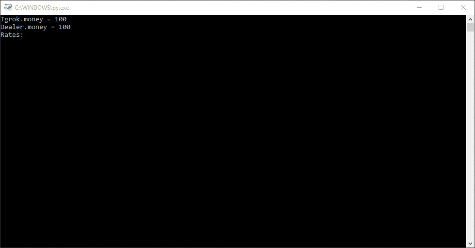

# Black_Jack (ООП)


```
("A", "2", "3", "4", "5", "6", "7", "8", "9", "В" , "Д" , "К" , "Т" )
("1", "2", "3", "4", "5", "6", "7", "8", "9", "10", "10", "10", "11")
```

>You must score more points than the dealer, but not more than 21.



